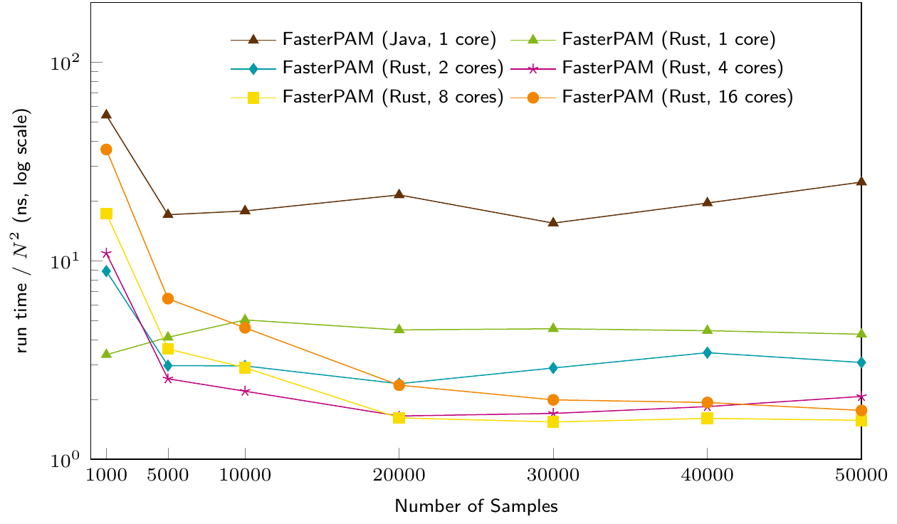

# Summary

A popular technique to cluster non-Euclidean data using arbitrary distance
functions or similarities is k-medoids. The k-medoids problem is NP-hard [@Kariv/Hakimi/79a], hence we need an approximative solution. The best known algorithm for a heuristic
solution with local optimization techniques is Partioning Around Medoids [PAM, @Kaufman/Rousseeuw/87a; -@Kaufman/Rousseeuw/90b], which uses a greedy search, that is significantly faster than an exhaustive search.
FasterPAM [@Schubert/Rousseeuw/2021a] recently introduced a speedup for larger k, by clever caching of partial results. Originally FasterPAM was implemented in Java and published within the open-source library ELKI [@Schubert/Zimek/2019a]. 

We developed the ``rust-kmedoids`` crate (https://github.com/kno10/rust-kmedoids) with implementations of various algorithms of k-medoids clustering, including FasterPAM. It can be used with arbitrary dissimilarites, as it requires a dissimilarity matrix as input. We also provide optional parallelization using rayon. The Rust version is then wrapped for use with Python in ``python-kmedoids`` (https://github.com/kno10/python-kmedoids).

# Benchmark

To benchmark the FasterPAM implementation in Rust, we compare the run time of related k-medoids implementations with the Rust implementation. We take the popular MNIST dataset [@lecun-mnisthandwrittendigit-2010] as input with different number of samples. We evaluate the FasterPAM algorithm in the ELKI open-source toolkit [@Schubert/Zimek/2019a] in Java, k-medoids alternating implementation of ``sklearn_extra.cluster.KMedoids``  (https://github.com/scikit-learn-contrib/scikit-learn-extra) in Python, ``PyClustering`` [@Novikov2019] in Python and C++, and ``BanditPAM`` [@BanditPAM] in Python and C++. We choose a random initialization and precompute a distance matrix with euclidian distance (L2 norm). BanditPAM cannot handle precomputed distance matrices, hence we evaluate BanditPAM separately with including of run time for distance computation.

We run 25~restarts on an AMD EPYC~7302 processor using a single thread, and evaluate the average values. For parallel FasterPAM implementation in Rust we use up to 16 threads on 16 cores and for PyClustering we evaluate only 1 restart due to long run time.

The fastest version without parallel processing is the FasterPAM in Rust with 3.02 ns/$n^2$. The original FasterPAM implementation in ELKI took 18.03 ns/$n^2$, almost 6 times longer. Also sklearn-extra is slower with 9.01 ns/$n^2$, which corresponds to a speedup factor of 3$\times$.

{ width=90% }

# Figures

# Acknowledgements

# References

